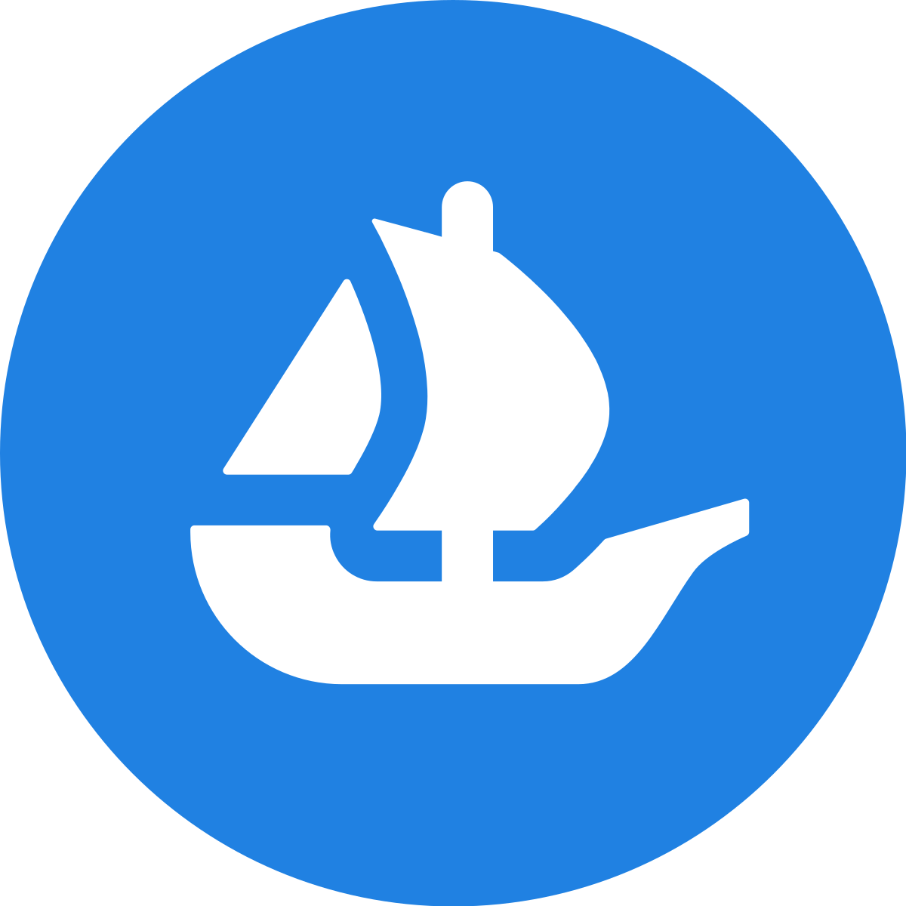
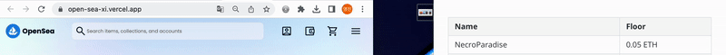
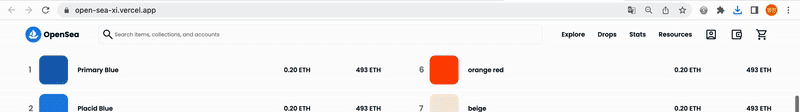
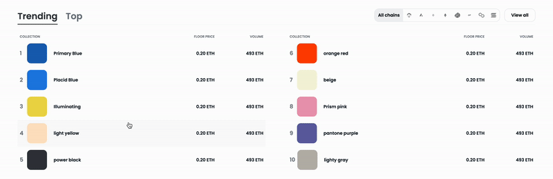

## OpenSea

> 세계 최대 NFT 마켓플레이스, NFT 거래 플랫폼
>
> 디지털 아트, 음악, 도메인 이름, 카드 등 디지털 자산을 자유롭게 거래
>
> `React` `SCSS`를 사용한 클론코딩

 

## 프로젝트 소개

[https://open-sea-xi.vercel.app/](https://open-sea-xi.vercel.app/)

> vercel 배포

 

### 메인 페이지

 

### 반응형

> 반응형 768px > 1200px > 1600px > 2256px
>
> 최대 컨테이너 길이 2560px (영상배너는 제외)

 

### 반응형 헤더

 

### 스크롤에 따라 바뀌는 헤더영역

> 현재 윈도우의 top값이 헤더 길이를 넘어가면 흰색으로 변경

 

### 헤더 드롭다운

 

### 탭 메뉴

 

### Swiper 반응형

> 300px > 600px > 768px > 1024px > 2256px

 

### 콘텐츠 카드 hover 1

 

### 콘텐츠 카드 hover 2

 

### 반응형 푸터

 

### 아쉬운 점

- 통일된 화폐로고 svg 파일이 없어, 사이즈 차이가 발생
- 영상이 재생되는 배너가 사라져, 중간에 배너 레이아웃을 바꿨지만 다음엔 영상 배너 레이아웃을 구현할 것
- Swiper의 `prev/next`버튼 위치를 카드 테두리의 중간정도에 걸치게 할 것
- 데이터 파일을 만들어서 바인딩 하지 않고, 하드코딩한 점